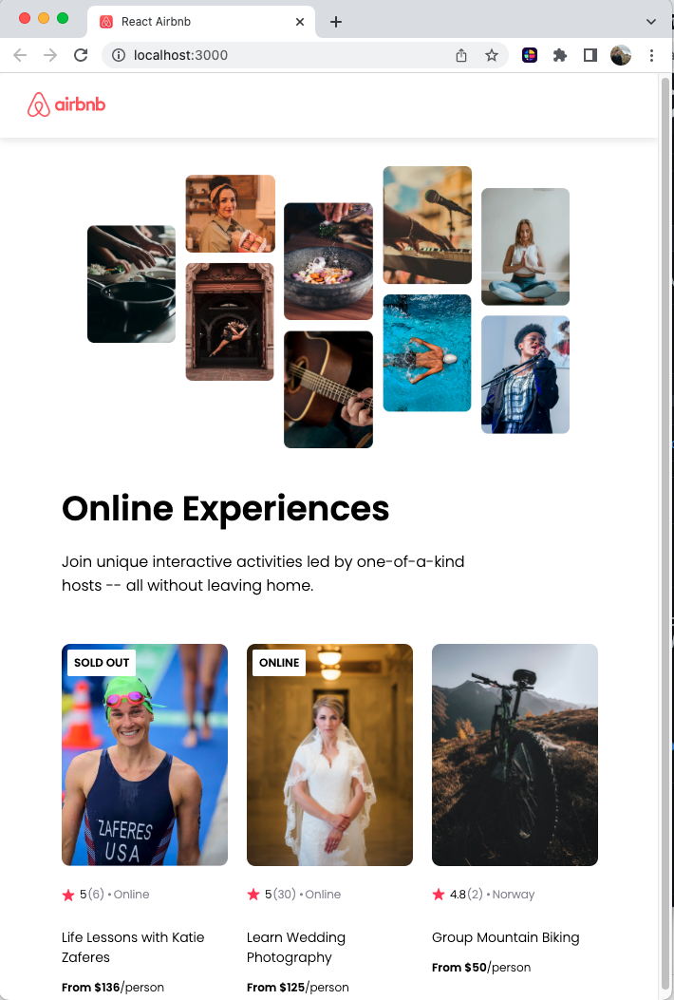

# React Airbnb Module

#### This project was designed to take my React
 skills to the next level by creating an AirBnB
 Experiences clone. I utilized HTML/CSS,
 JavaScript, and of course React to build this 
page.

Things that I learned on this project was the
 ability to scale every text using rem instead
 of pixels, and to also create individual 
components so they may be reused. Specifically
 a card component, that did not have any of the 
data hard coded in, but rather was able to fetch
 the data from a separate file that I had saved 
locally, to represent fetching real data from 
an API database. That information then was 
populated into my card component using the map 
function.

I like how this info is clean and clear, and 
able to present my desired results, all while 
using React. Now onto my next project!

### https://react-jackson-airbnb.netlify.app
